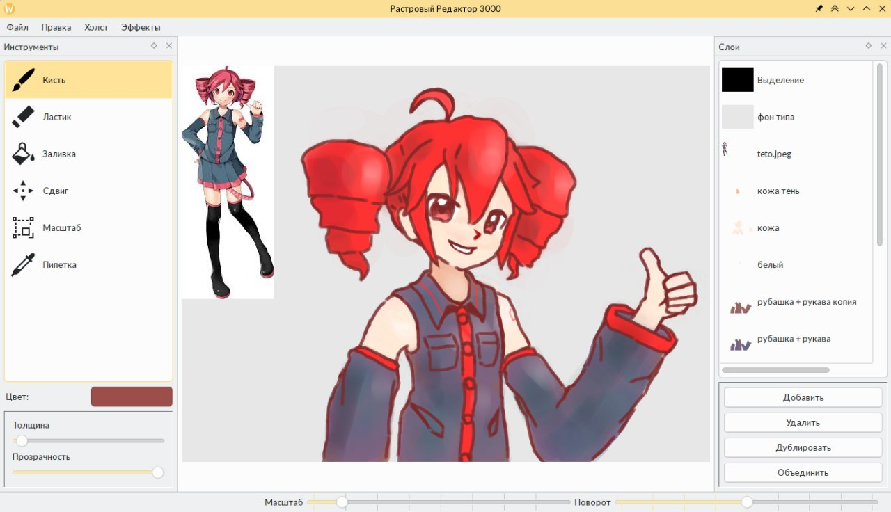

# Paint (Qt6)

Coursework from the second year of the university. Implements a simple bitmap
graphics editor with smoothly moving brush, eraser, edit history, transformation
tools, bucket and eyedropper tool, inverting and brightness-contrast effects,
importing/exporting images.

Курсовая работа со второго курса обучения в университете. Реализует простой
редактор растровой графики с гладко двигающейся кистью, ластиком, историей
правок, инструментами трансформации, заливкой, пипеткой, эффектом инверсии и
яркости-контраста, импорт/экспорт изображений.

## Build Requirements / Требования для сборки

- Linux (Non-Wayland session breaks tools behaviour/
         Не Wayland сессия ломает поведение инструментов)
- Qt6 (`qt6-base-dev`)
- CMake 3.5+ (`cmake`)

The package names mentioned below are valid for Debian-based distros.

Названия выше упомянутых пакетов справедливы для дистрибутивов на основе Debian.

## Known Issues / Известные проблемы

- Tools won't work with non-Wayland session. This bug was discovered late in
  development and I had no time to fix it.

- Memory leaks when using undo/redo. Seem to a problem with my object handling.

###

- Инструменты не будут работать на не Wayland сессии. Баг был обнаружен в
  поздней стадии разработки и времени на его исправление не было.

- Утечки памяти при использовании отмены/повтора. Проблема скорее всего в моём
  управлении объектами.

## Atribution / Атрибуция

The project uses [this](https://github.com/reunanen/qt-image-flood-fill)
implementation of the flood-fill function (`buckettool.cpp`). See
`about/LICENSE`.

Проект использует [эту](https://github.com/reunanen/qt-image-flood-fill)
реализацию функции заливки (`buckettool.cpp`). Смотрите `about/LICENSE`.
